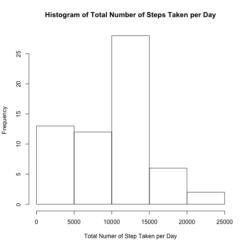
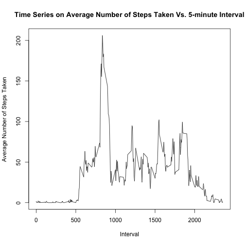
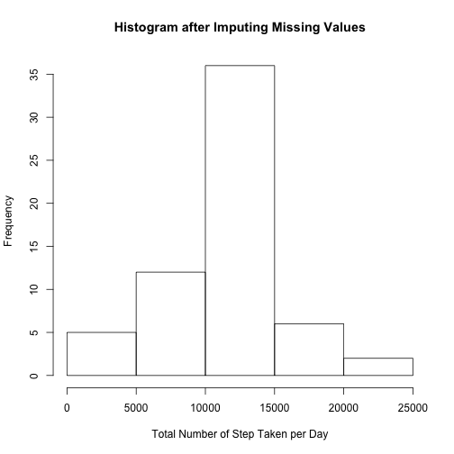
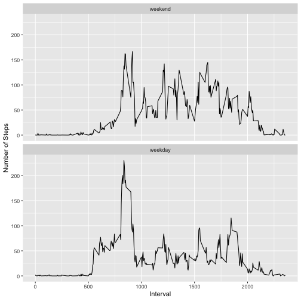

## Setting your current working directory. 
### (For Peer-reviewers: please kindly configure your working directory.)

```r
setwd("~/Desktop/JZForPractice/coursera/RepData_PeerAssessment1")
```

## Loading and preprocessing the data
### 1. Code for reading in the dataset and/or processing the data

```r
data <- read.csv("activity.csv")
data$steps <- as.numeric(data$steps)
data$interval <- as.numeric(data$interval)
```


## What is mean total number of steps taken per day?

### 2. Histogram of the total number of steps taken each day

```r
library(dplyr)

# Calculate the total number of steps taken per day, ignoring missing values.
daily_steps <- data %>% group_by(date) %>% summarize(sum_steps = sum(steps, na.rm=TRUE))

# Plot the histogram
hist(daily_steps$sum_steps, 
     main = "Histogram of Total Number of Steps Taken per Day", 
     xlab = "Total Numer of Step Taken per Day")
```



### 3. Mean and median number of steps taken each day

```r
# Calculate and report the mean and median of the total number of steps taken per day
mean_total_number_of_steps_taken_per_day <- format(mean(daily_steps$sum_steps, na.rm=TRUE), scientific = FALSE)
median_toal_number_of_steps_taken_per_day <- format(median(daily_steps$sum_steps, na.rm=TRUE), scientific=FALSE)

print (paste("mean: ", mean_total_number_of_steps_taken_per_day))
```

```
## [1] "mean:  9354.23"
```

```r
print (paste("median: ", median_toal_number_of_steps_taken_per_day))
```

```
## [1] "median:  10395"
```
The mean   is ``9354.23``.
The median is ``10395``.


## What is the average daily activity pattern?

### 4. Time series plot of the average number of steps taken

```r
library(dplyr)

# Calculate the total number of steps taken per interval, ignoring missing values.
daily_average_steps <- data %>% group_by(interval) %>% summarize(mean_steps = mean(steps, na.rm=TRUE))

# Make a time series plot (i.e. type="l") of the 5-minute interval (x-axis) and the average number of steps taken, averaged across all days (y-axis)
plot(daily_average_steps$interval, 
     daily_average_steps$mean_steps, 
     type="l", 
     main = "Time Series on Average Number of Steps Taken Vs. 5-minute Interval",
     xlab = "Interval",
     ylab = "Average Number of Steps Taken")
```



### 5. The 5-minute interval that, on average, contains the maximum number of steps

```r
interval_with_max_average_number_of_steps <- daily_average_steps[order(daily_average_steps$mean_steps, decreasing = TRUE)[1], "interval"][[1]]
print (interval_with_max_average_number_of_steps)
```

```
## [1] 835
```

The 5-minute interval [``835``, ``840``), on average across all the days in the dataset, contains the maximum number of steps.

## Imputing missing values


```r
missing_values_data <- data[is.na(data$steps),]

number_of_rows_with_NA_values <- dim(missing_values_data)[1]
```
The Number of Missing Values is ``2304``.

### 6. Code to describe and show a strategy for imputing missing data

Strategy: impute missing data by its 5-min interval mean.


```r
join_data <- merge(data, daily_average_steps, by = c("interval"))
join_data[is.na(join_data$steps), "steps"] <- join_data[is.na(join_data$steps), "mean_steps"]
```

### 7. Histogram of the total number of steps taken each day after missing values are imputed


```r
# Calculate the total number of steps taken per day, ignoring missing values.
daily_steps_after_impute <- join_data %>% group_by(date) %>% summarize(sum_steps = sum(steps, na.rm=TRUE))

# Plot the histogram
hist(daily_steps_after_impute$sum_steps, 
     main = "Histogram after Imputing Missing Values", 
     xlab = "Total Number of Step Taken per Day")
```



### Mean and median number of steps taken each day after imputing missing values

```r
# Calculate and report the mean and median of the total number of steps taken per day
mean_total_number_of_steps_taken_per_day_after_impute <- format(mean(daily_steps_after_impute$sum_steps, na.rm=TRUE), scientific = FALSE)
median_toal_number_of_steps_taken_per_day_after_impute <- format(median(daily_steps_after_impute$sum_steps, na.rm=TRUE), scientific=FALSE)

print (paste("mean: ", mean_total_number_of_steps_taken_per_day_after_impute))
```

```
## [1] "mean:  10766.19"
```

```r
print (paste("median: ", median_toal_number_of_steps_taken_per_day_after_impute))
```

```
## [1] "median:  10766.19"
```
The mean   is ``10766.19``.
The median is ``10766.19``.

The mean / median are different from the previous calculations. And imputing with average by interval will give exactly the same mean / median on total number of steps per day.

## Are there differences in activity patterns between weekdays and weekends?

### 8. Panel plot comparing the average number of steps taken per 5-minute interval across weekdays and weekends


```r
library(ggplot2)
# Convert factor to date.
join_data$date_obj <- as.Date(join_data$date, format="%Y-%m-%d")
join_data$weekday <-factor((weekdays(join_data$date_obj) %in% c('Monday', 
                                                                'Tuesday', 
                                                                'Wednesday', 
                                                                'Thursday', 
                                                                'Friday')), 
                           levels=c(FALSE, TRUE), 
                           labels=c('weekend', 'weekday'))

average_steps_by_interval_weekday <- join_data %>% group_by(weekday, interval) %>% summarise(mean_steps = mean(steps, na.rm=TRUE))

panel_plot <- ggplot(data = average_steps_by_interval_weekday, aes(x = interval, y = mean_steps)) + geom_line() + facet_wrap( ~ weekday, nrow = 2) + labs(y = "Number of Steps") + labs(x = "Interval")

print (panel_plot)
```


